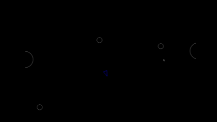

# Asteroids

A small clone of the classic **Asteroids** arcade game written in **Python** using **Pygame**.  
This project started as a guided Boot.dev course and I extended and refactored it to practice game loops, object-oriented design, and collision detection.

---

## Demo



## Features
- Player ship that can rotate, thrust, and fire shots
- Asteroids that drift across the screen and wrap around the edges
- Asteroids split into smaller pieces when hit (classic Asteroids behavior)
- Circle-based collision detection between player, shots, and asteroids
- Simple game-over logic when the player collides with an asteroid
- Configurable constants for window size, speeds, and colors
- Lightweight logging utility for debugging game state

## Project Structure
```bash
.
├── asteroid.py        # Asteroid class: movement, drawing, splitting
├── asteroidfield.py   # Spawns and manages multiple asteroids
├── circleshape.py     # Base class for circular game objects + collision helper
├── constants.py       # Window size, speeds, colors, timing constants
├── logger.py          # Simple logging helpers (for debugging)
├── main.py            # Entry point and main game loop
├── player.py          # Player ship: controls, thrust, firing shots
├── shot.py            # Shot/bullet objects fired by the player
├── requirements.txt   # Python dependencies (e.g. pygame)
└── .gitignore         # Ignore venv, __pycache__, etc.
```

## Tech Stack
- Language: Python 3
- Library: Pygame
- Paradigm: Object-oriented design with a main game loop
- Environment: Runs locally on Windows, macOS, or Linux